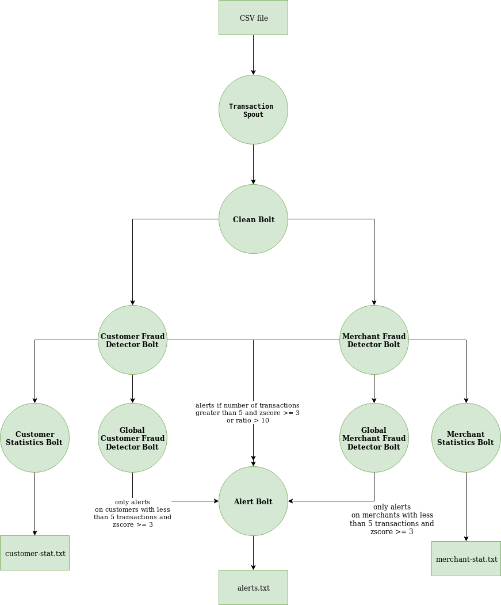

# Apache Storm Payment Fraud Detection
The project code creates a simplified fraud detector topology using Apache Storm. Simple statistics including mean and standard deviation are used to detect anomalies. [Welford's online algorithm](https://en.wikipedia.org/wiki/Algorithms_for_calculating_variance#Welford's_online_algorithm) is used in [TransactionTracker](multilang/resources/transaction_tracker.py) to calculate the variance in constant space.

Statistics are tracked for each customer in a customer bolt. Transactions are submitted to an alert bolt if anomalies are detected i.e. transaction is greater than or equal to 3 standard deviations from the customer historic mean. However, global statistics are tracked for all customers in a global customer bolt. The global customer bolt only alerts if a customer has less than 5 transactions and the transaction amount is greater than or equal to 3 standard deviations from the global historic mean. 

Merchants statistics are also tracked in the same way as customers. 

# Definitions

A `customer` is an entity who holds an account.

A `merchant` is an entity who accepts payments. 

# Environment Setup

## Java

You need java installed to run the project. Recommended version is `openjdk version "1.8.0_222"`.

## Python

You need certain python libraries to run the project. Anaconda is the recommended environment manager for python.

```
$ conda create -n fraudDetector python==3.7.4 numpy==1.16.4
$ conda activate fraudDetector
```

## Maven
You need maven to build the jar file. Recommend `Apache Maven 3.6.0`. 

## Storm
Apache Storm is distributed realtime computation system and makes processing streams of data easy.

* Download [apache-storm-2.0.0.tar.gz](http://storm.apache.org/downloads.html) 
* Decompress files to a directory  
* Update `PATH` variable to include `apache-storm-2.0.0/bin/`

```
$ tar -xvf apache-storm-2.0.0.tar.gz ./
$ export PATH="the-path-to-apache-storm/apache-storm-2.0.0/bin/:$PATH" 
```

# Topology



# File structure
This projects combines java and python.


## FraudDetectorTopology
The [FraudDetectorTopology](src/main/java/FraudDetectorTopology.java) bootstraps the application. In the `run` method, the spouts and bolts are wired up.

## Spouts
The [TransactionSpout](src/main/java/spouts/TransactionSpout.java) reads the csv file provided and emits a line to the [CleanDataBolt](src/main/java/bolts/CleanDataBolt.java).

Note: In the `process` function, the value provided to `Utils.sleep` can be adjusted if Apache Storm sends a backpressure status.   

## Bolts
The [AlertBolt](src/main/java/bolts/AlertBolt.java), [MerchantStatsBolt](src/main/java/bolts/MerchantStatsBolt.java), and [CustomerStatsBolt](src/main/java/bolts/CustomerStatsBolt.java) are implemented in java. The other bolts are implemented in python. You can find the python files in the [multilang](multilang) directory.


# Run

After installing the few dependencies, use the following commands to process the transactions.

```
$ mvn package
```

```
$ storm local target/fraud-detection-1.0-SNAPSHOT-jar-with-dependencies.jar FraudDetectorTopology
```

Note: The processing runs for 10 minutes and then exits. Update the `Utils.sleep` value in [FraudDetectorTopology](src/main/java/FraudDetectorTopology.java) and  [TransactionSpout](src/main/java/spouts/TransactionSpout.java) to change the timeout value.

## View output

Storm logs frequently to standard output and makes viewing the statistics and alerts difficult. To remedy this, the topology logs statistics and alerts to a file on disk. Open additional terminal windows and run the following commands.

### Alerts
```
$ tail -f alerts.txt
```

### Customer statistics
```
$ tail -f customer-stat.txt
```


### merchant statistics
```
$ tail -f merchant-stat.txt
```


## Output


## Alerts
```
$ tail -f  alerts.txt 
boltName: MerchantFraudDetector,	accountId: 1,	merchantId: A,	amount: 70.00
boltName: MerchantFraudDetector,	accountId: 1,	merchantId: A,	amount: 70.00
boltName: CustomerFraudDetector,	accountId: 1,	merchantId: C,	amount: 500.00
boltName: MerchantFraudDetector,	accountId: 1,	merchantId: C,	amount: 500.00
boltName: MerchantFraudDetector,	accountId: 2,	merchantId: B,	amount: 250.00
boltName: CustomerFraudDetector,	accountId: 2,	merchantId: B,	amount: 250.00
```

## Customer

```
$ tail -f customer-stats.txt

accountId: 1	count: 295.00	amount: 20.00	mean: 39.60	std: 33.88	min: 20.00	max: 500.00	ratio: 1.00
accountId: 1	count: 296.00	amount: 70.00	mean: 39.70	std: 33.87	min: 20.00	max: 500.00	ratio: 3.50
accountId: 1	count: 297.00	amount: 30.50	mean: 39.67	std: 33.82	min: 20.00	max: 500.00	ratio: 1.53
accountId: 1	count: 298.00	amount: 20.00	mean: 39.61	std: 33.78	min: 20.00	max: 500.00	ratio: 1.00
accountId: 1	count: 299.00	amount: 30.50	mean: 39.58	std: 33.73	min: 20.00	max: 500.00	ratio: 1.53
accountId: 1	count: 300.00	amount: 20.00	mean: 39.51	std: 33.69	min: 20.00	max: 500.00	ratio: 1.00
accountId: 1	count: 301.00	amount: 70.00	mean: 39.61	std: 33.68	min: 20.00	max: 500.00	ratio: 3.50

...
...

accountId: 2	count: 292.00	amount: 100.00	mean: 54.01	std: 38.51	min: 10.00	max: 250.00	ratio: 10.00
accountId: 2	count: 293.00	amount: 10.00	mean: 53.86	std: 38.53	min: 10.00	max: 250.00	ratio: 1.00
accountId: 2	count: 294.00	amount: 50.00	mean: 53.84	std: 38.46	min: 10.00	max: 250.00	ratio: 5.00
accountId: 2	count: 295.00	amount: 100.00	mean: 54.00	std: 38.49	min: 10.00	max: 250.00	ratio: 10.00
accountId: 2	count: 296.00	amount: 10.00	mean: 53.85	std: 38.51	min: 10.00	max: 250.00	ratio: 1.00
accountId: 2	count: 297.00	amount: 50.00	mean: 53.84	std: 38.45	min: 10.00	max: 250.00	ratio: 5.00
accountId: 2	count: 298.00	amount: 100.00	mean: 53.99	std: 38.48	min: 10.00	max: 250.00	ratio: 10.00
accountId: 2	count: 299.00	amount: 10.00	mean: 53.85	std: 38.49	min: 10.00	max: 250.00	ratio: 1.00
accountId: 2	count: 300.00	amount: 50.00	mean: 53.83	std: 38.43	min: 10.00	max: 250.00	ratio: 5.00
accountId: 2	count: 301.00	amount: 100.00	mean: 53.99	std: 38.46	min: 10.00	max: 250.00	ratio: 10.00
```

## Merchant

```
tail -f merchant-stats.txt
merchantId: C	accountId: 2	count: 198.00	amount: 100.00	mean: 71.05	std: 45.73	min: 20.00	max: 500.00	ratio: 5.00
merchantId: A	accountId: 2	count: 198.00	amount: 10.00	mean: 24.08	std: 20.17	min: 10.00	max: 70.00	ratio: 1.00
merchantId: B	accountId: 2	count: 199.00	amount: 50.00	mean: 44.81	std: 21.55	min: 20.00	max: 250.00	ratio: 2.50
merchantId: C	accountId: 2	count: 199.00	amount: 100.00	mean: 71.19	std: 45.66	min: 20.00	max: 500.00	ratio: 5.00
merchantId: A	accountId: 2	count: 199.00	amount: 10.00	mean: 24.01	std: 20.15	min: 10.00	max: 70.00	ratio: 1.00
merchantId: B	accountId: 2	count: 200.00	amount: 50.00	mean: 44.84	std: 21.50	min: 20.00	max: 250.00	ratio: 2.50
merchantId: C	accountId: 2	count: 200.00	amount: 100.00	mean: 71.34	std: 45.59	min: 20.00	max: 500.00	ratio: 5.00
merchantId: A	accountId: 2	count: 200.00	amount: 10.00	mean: 23.94	std: 20.12	min: 10.00	max: 70.00	ratio: 1.00
merchantId: B	accountId: 2	count: 201.00	amount: 50.00	mean: 44.86	std: 21.45	min: 20.00	max: 250.00	ratio: 2.50
merchantId: C	accountId: 2	count: 201.00	amount: 100.00	mean: 71.48	std: 45.52	min: 20.00	max: 500.00	ratio: 5.00

```

# Python Tests
It's recommended to use a python IDE such as pycharm to edit and test the python files in the [multilang](multilang) directory.

In pycharm, you can right click on the tests package and select `Run 'Unittests in tests'` The terminal output should look similar to the following.

```
Process finished with exit code 0


Ran 28 tests in 0.440s

OK
```